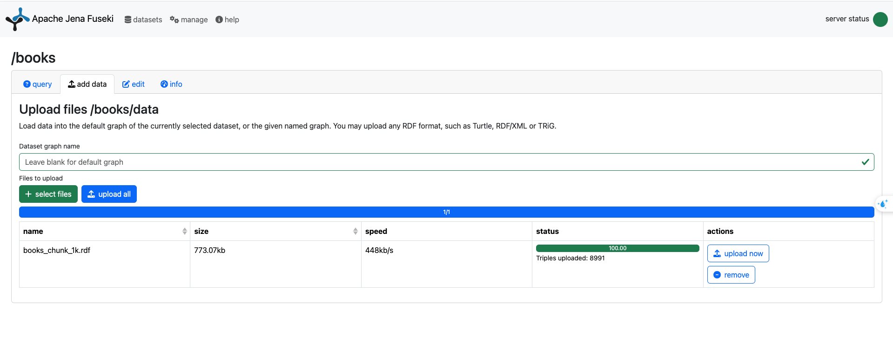
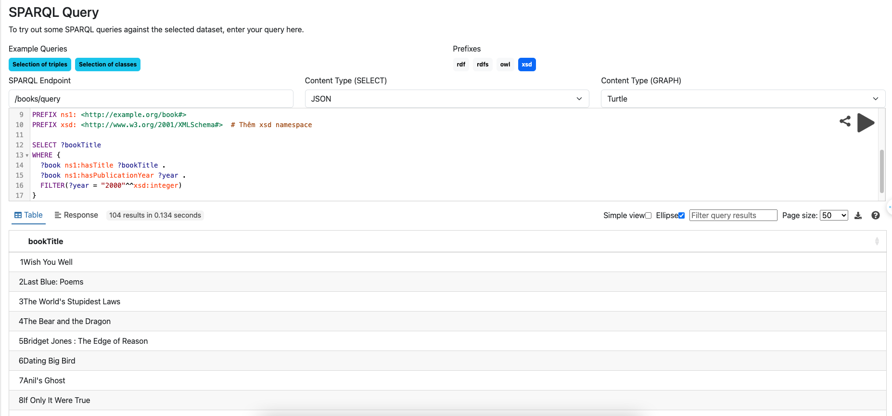

# Book Ontology and Semantic Search with Apache Jena Fuseki

This project showcases the use of **ontology** for managing and searching books using **Apache Jena Fuseki**, a SPARQL endpoint for querying RDF data. The ontology models the core concepts related to books, such as title, author, ISBN, publisher, and year of publication, and provides a flexible way to query the book dataset using semantic search.

## Table of Contents

- [Overview](#overview)
- [Features](#features)
- [Requirements](#requirements)
- [Installation](#installation)
- [Usage](#usage)
  - [Importing RDF Data](#importing-rdf-data)
  - [Running SPARQL Queries](#running-sparql-queries)
  - [Sample Queries](#sample-queries)
- [Contributing](#contributing)
- [License](#license)

## Overview

This project defines an RDF-based ontology for books and demonstrates how you can store, query, and retrieve book information using semantic search with **Apache Jena Fuseki**. The book ontology includes:
- **ISBN**: The unique identifier for each book.
- **Title**: The name of the book.
- **Author**: The person who wrote the book.
- **Year of Publication**: The year the book was published.
- **Publisher**: The company that published the book.
- **Book cover images**: URLs to small, medium, and large images of book covers.

By using **semantic web technologies**, this project allows you to perform more meaningful queries on books rather than just simple keyword searches. 

You can download all dataset from this link: https://terabox.link/s/1Od9JyF5lJXH6fWW0j-N6Fw

## Features

- **Book Ontology**: Provides an RDF-based structure for modeling books and their metadata.
- **SPARQL Endpoint**: Offers a way to query books using **Apache Jena Fuseki**.
- **Semantic Search**: Perform advanced searches using SPARQL with support for filters, reasoning, and relationships.
- **Data Import**: Import large datasets (e.g., 200,000 books) in RDF format to Fuseki.
- **Sample Queries**: Includes example SPARQL queries to get started quickly.

## Requirements

- **Apache Jena Fuseki** (v3.17.0 or later)
- **Python** (v3.7 or later) for data preprocessing (optional)
- A dataset of books in CSV format

## Installation

### 1. Download and install **Apache Jena Fuseki**:

You can download the latest version of Fuseki from the [Apache Jena website](https://jena.apache.org/download/).

### 2. Clone the repository:

```bash
git clone https://github.com/yourusername/book-ontology-fuseki.git
cd book-ontology-fuseki
```

### 3. (Optional) Set up the environment for preprocessing data:

```bash
python3.9 -m venv myenv
source myenv/bin/activate
pip3 install -r requirements.txt
```

## Usage

### Create RDF Data from CSV type
You must run this command to create a RDF file:
``` python3
python3 db_preprocess.py
```

### Importing RDF Data

1. Start **Apache Jena Fuseki** by running:

```bash
./fuseki-server --update --mem /books
```

This will start a Fuseki server with an in-memory dataset `/books`.

2. Import your RDF data into Fuseki. For example, you can use the following command:

```bash
curl -X POST --data-urlencode 'query=INSERT DATA { ... }' http://localhost:3030/books/update
```

Alternatively, you can use the Fuseki web interface (`http://localhost:3030`) to upload RDF files manually.

</img>

### Running SPARQL Queries

You can send SPARQL queries via the Fuseki web interface or through HTTP requests. Here's an example using `curl`:

```bash
curl -X POST \
  --data-urlencode 'query=PREFIX ns1: <http://example.org/book#> SELECT ?bookTitle WHERE { ?book ns1:hasTitle ?bookTitle . }' \
  http://localhost:3030/books/sparql
```

This query fetches all book titles stored in the `/books` dataset.
</img>

Or you can run from client with this command:
```python
python3 db_connect.py
```

### Sample Queries

Here are a few example queries you can run:

- **List all book titles and authors**:

```sparql
PREFIX ns1: <http://example.org/book#>
SELECT ?bookTitle ?authorName
WHERE {
  ?book ns1:hasTitle ?bookTitle .
  ?book ns1:hasAuthor ?authorName .
}
```

- **Find books published in a specific year (e.g., 2000)**:

```sparql
PREFIX ns1: <http://example.org/book#>
PREFIX xsd: <http://www.w3.org/2001/XMLSchema#>
SELECT ?bookTitle
WHERE {
  ?book ns1:hasTitle ?bookTitle .
  ?book ns1:hasPublicationYear ?year .
  FILTER(?year = "2000"^^xsd:integer)
}
```

- **Find books by a specific author**:

```sparql
PREFIX ns1: <http://example.org/book#>
SELECT ?bookTitle
WHERE {
  ?book ns1:hasTitle ?bookTitle .
  ?book ns1:hasAuthor "John Doe" .
}
```

## Contributing

Contributions are welcome! If you'd like to contribute to this project, please follow these steps:
1. Fork the repository.
2. Create a new branch (`git checkout -b feature-branch`).
3. Make your changes and commit them (`git commit -m 'Add new feature'`).
4. Push to the branch (`git push origin feature-branch`).
5. Open a pull request.

### Issues

If you encounter any problems or have suggestions for improvements, please open an [issue](https://github.com/yourusername/book-ontology-fuseki/issues).

---

This **README** file provides a basic introduction to your **ontology-based project** and includes sections on setup, usage, and contribution guidelines. Make sure to adjust specific details like the repository link and contact information before publishing. Let me know if you need any further adjustments!